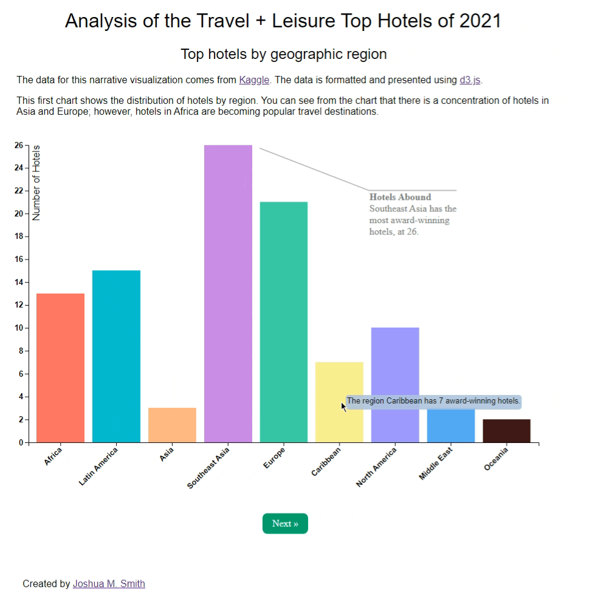

# UIUC Final Project for Data Visualization

This is a narrative visualization with three scenes exploring the top-rated hotels in the world, correlation with the years they were constructed and the theme of the hotel, as well as how those factors affect their ratings. The charts are built with [d3.js](https://d3js.org/).

Submitted for completion of the course Data Visualization as part of the Master of Computer Science program at University of Illinois Urbana-Champaign.

The data for this project is the [Travel+Leisure](https://www.travelandleisure.com/) magazine top-ranked hotels for end-of-year 2021, sourced from [Kaggle](https://www.kaggle.com/datasets/narmelan/travelleisure-worlds-best-hotels-2021?resource=download).

# Preview

# Accessing the Visualization

The visualization is hosted here on [Github Pages](https://joshuamarksmith.github.io/uiuc_datavis_su22/).
